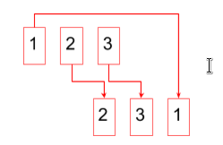

#FpInfor #DawMp03Uf01 #DawMp03Uf02 #Programació

Girar un número
=======================

Qualsevol número pot ser transformat en un altre fent rotar les seves xifres en una direcció.

O sigui que: 

* Número: 3452 →  4523
* Número: 12 →  21
* Número: 1200 →  2001

Això és pot anar repetint per obtenir més números

* Número: 675 →  675, 756, 567

* Número: 456789 → 456789, 567894, 678945, 789456, 894567, 945678

Activitat: Quin és el número més gran que es pot fer?
--------------------------------------------- 

Feu un programa que un cop li entrem un número ens diu:

* Quants números es poden crear girant les seves xifres
* Quin dels números és el més gran

Exemple: 

    Número: 3452 
      Es poden fer 4 números
      El més gran és 5234

    Número: 22
      Es pot fer 1 número
      El més gran és 22

